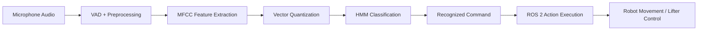

# HMM-Based Voice Control for a ROS 2 Mobile Robot 🤖🎙️

Voice recognition module for controlling robot movement and lifter actions using **MFCC**, **Vector Quantization**, and **Hidden Markov Models**, integrated with **ROS 2**.

---

## Overview

This repository contains the voice recognition module developed as part of a larger autonomous mobile robot project.

The complete team project integrated perception, navigation, control, hardware/software communication, and human-robot interaction. This repository focuses on my main contribution: an **HMM-based voice recognition system** capable of recognizing isolated spoken commands and translating them into real robot actions through ROS 2.

The module controls two main parts of the robot:

* Mobile base movement
* Lifter mechanism actions

---

## Demo 🎥

The demo video shows the robot responding to voice-based commands by executing movement and lifter actions.
https://youtu.be/RmwOvbU-bH8

**Video description:**

> Demonstration of the HMM-based voice recognition module integrated into a ROS 2 mobile robot. The video shows spoken commands being recognized and translated into real robot actions, including base movement and lifter mechanism control.

---

## My Contribution

My main contribution was the development and integration of the **voice recognition module**.

I worked on the complete audio-processing pipeline:

* Audio preprocessing and Voice Activity Detection
* MFCC feature extraction
* Vector Quantization using a global codebook
* Discrete Hidden Markov Model training per command
* Baum-Welch refinement with early stopping
* Command classification using log-likelihood scoring
* ROS 2 integration for robot movement and lifter control

The goal was not only to train a speech recognition model, but to make it interact with a physical robotic system in real time.

---

## System Workflow ⚙️



---

## Supported Commands

| Voice command     | Robot action                   |
| ----------------- | ------------------------------ |
| `avanza`          | Move forward                   |
| `atras` / `atrás` | Move backward                  |
| `izquierda`       | Turn left                      |
| `derecha`         | Turn right                     |
| `gira`            | Perform a 360-degree turn      |
| `detente`         | Stop the robot                 |
| `arriba`          | Move lifter to upper position  |
| `abajo`           | Lower lifter                   |
| `toma`            | Move lifter to pickup position |
| `suelta`          | Release/lower lifter           |

---

## Technical Approach 🧠

The recognition system follows a classical speech recognition pipeline.

1. **Audio capture**
   The system records an isolated spoken command from the microphone.

2. **Preprocessing**
   The signal is normalized and trimmed using Voice Activity Detection to reduce silence and irrelevant audio segments.

3. **MFCC extraction**
   Mel-Frequency Cepstral Coefficients are extracted to represent the speech signal in a compact and meaningful way.

4. **Vector Quantization**
   MFCC vectors are converted into discrete symbols using a global codebook.

5. **Hidden Markov Models**
   One discrete left-to-right HMM is trained for each voice command.

6. **Command prediction**
   The input sequence is scored against all trained HMMs, and the command with the highest log-likelihood is selected.

7. **ROS 2 execution**
   The recognized command is mapped to a robot action and published through ROS 2 topics.

---

## Results 📊

The model was evaluated on a held-out test set for 10 isolated voice commands.

| Metric                    |          Result |
| ------------------------- | --------------: |
| Test accuracy             |       **98.0%** |
| Number of commands        |          **10** |
| Codebook size             | **256 symbols** |
| HMM states per command    |           **5** |
| Baum-Welch max iterations |          **20** |
| Early stopping patience   |           **3** |

The evaluation included:

* Confusion matrix
* Per-class precision, recall, and F1-score
* Accuracy by speaker
* Baum-Welch log-likelihood history
* Sequence length analysis after VAD

The results showed strong recognition performance, with most predictions concentrated on the main diagonal of the confusion matrix.

---

## ROS 2 Integration

The main runtime node records audio, predicts the spoken command, and publishes the corresponding robot action.

### Main ROS 2 outputs

| Topic           | Purpose                                       |
| --------------- | --------------------------------------------- |
| `/cmd_vel`      | Sends velocity commands to the robot base     |
| `/lift_auto`    | Sends lifter state commands                   |
| `/lift_trigger` | Sends stop/reset trigger to the lifter system |

---

## Main Files

| File                   | Purpose                                                                           |
| ---------------------- | --------------------------------------------------------------------------------- |
| `hmm_from_scratch.py`  | Implementation of discrete Bakis HMMs, Forward, Backward, Viterbi, and Baum-Welch |
| `run_hmm.py`           | Training and evaluation pipeline                                                  |
| `voice_action_node.py` | ROS 2 node for live voice recognition and robot action execution                  |
| `grab_audio.py`        | Utility script for recording isolated voice commands                              |

---

## Technologies Used

* Python
* ROS 2
* NumPy
* SciPy
* pandas
* matplotlib
* sounddevice
* soundfile
* MFCC
* Vector Quantization
* Hidden Markov Models
* Digital Signal Processing
* Robot Control

---

## How to Run

### Install dependencies

```bash
pip install numpy scipy pandas matplotlib sounddevice soundfile
```

### Build the ROS 2 package

From the root of the ROS 2 workspace:

```bash
colcon build --packages-select voice_hmm_ros
source install/setup.bash
```

### Train the model

```bash
python3 run_hmm.py \
  --dataset-dir ./dataset_unificado \
  --results-dir resultados_hmm \
  --refine-bw \
  --bw-iters 20 \
  --bw-tol 0.05 \
  --bw-patience 3 \
  --n-states 5 \
  --verbose
```

### Run live voice control

```bash
ros2 run voice_hmm_ros voice_action_node \
  --model-dir resultados_hmm/models \
  --codebook-path resultados_hmm/codebook.npy
```

---

## Repository Notes

The original dataset included voice recordings from multiple speakers. The full audio dataset is not included in this repository for privacy and size reasons.

This repository focuses on the source code, model pipeline, ROS 2 integration, and evaluation outputs of the voice recognition module.

---

## Limitations

This system was designed for isolated command recognition in a controlled robotics environment.

Current limitations:

* Fixed vocabulary of 10 commands
* Sensitive to microphone quality and background noise
* Designed for isolated words, not continuous speech
* May require retraining for new speakers or different acoustic environments
* Robot behavior may need adjustment depending on hardware and ROS 2 topic configuration

---

## Future Improvements

Potential next steps:

* Expand the dataset with more speakers and noise conditions
* Improve unknown-command rejection
* Add wake-word detection
* Compare HMM performance with lightweight neural models
* Add launch files for easier deployment
* Improve robustness in real-world environments

---

## Acknowledgments 🙌

This module was developed as part of a larger team robotics project.

The complete system required collaboration across perception, navigation, control, hardware/software integration, and robot behavior. I am grateful to my team for the problem-solving, debugging, and integration work that made the full project possible.
